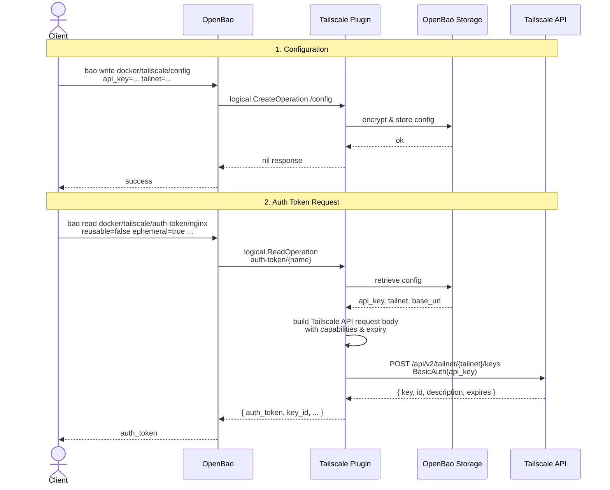

# OpenBao Secrets Engine for Tailscale

An OpenBao secrets engine plugin that dynamically generates short-lived, preauthorized, and ephemeral Tailscale node authentication keys on-demand.

## How it Works

When a client queries OpenBao for a secret at path `docker/tailscale/auth-token/<service-name>` (e.g. `docker/tailscale/auth-token/nginx`), the plugin makes an API request to Tailscale to generate a node auth key. The name of the service (`nginx` in this case) is used as the key's description in the Tailscale admin console, making it easy to track which key was generated for which workload.



## Directory Structure

* `main.go` - Entrypoint for the OpenBao plugin server.
* `backend.go` - Sets up the backend routing and paths.
* `path_config.go` - Handles setting and reading Tailscale API key and Tailnet name.
* `path_auth_token.go` - Handles generating dynamic auth keys via the Tailscale API.
* `Dockerfile` - Multi-architecture builder to compile the plugin for macOS and Linux.

## Compilation

You can compile the plugin binaries using Docker without having Go installed on your host.

1. Build the builder image:
   ```bash
   docker build -t openbao-tailscale-builder .
   ```

2. Run the builder to extract the binaries:
   ```bash
   docker run --rm -v "$(pwd)/bin:/out" openbao-tailscale-builder
   ```

This will output:
* `openbao-plugin-secrets-tailscale-darwin-arm64` (Apple Silicon Mac)
* `openbao-plugin-secrets-tailscale-darwin-amd64` (Intel Mac)
* `openbao-plugin-secrets-tailscale-linux-arm64` (Linux ARM64)
* `openbao-plugin-secrets-tailscale-linux-amd64` (Linux AMD64)

## Installation & Configuration

1. **Move binary to your OpenBao plugins directory**:
   ```bash
   mkdir -p /path/to/openbao-plugins
   cp bin/openbao-plugin-secrets-tailscale-darwin-arm64 /path/to/openbao-plugins/openbao-plugin-secrets-tailscale
   chmod +x /path/to/openbao-plugins/openbao-plugin-secrets-tailscale
   ```

2. **Start OpenBao with the plugin directory loaded**:
   ```bash
   bao server -dev -dev-root-token-id="dev-only-token" -dev-plugin-dir="/path/to/openbao-plugins"
   ```

3. **Register and enable the plugin**:
   ```bash
   # Calculate checksum
   export PLUGIN_SHA=$(shasum -a 256 /path/to/openbao-plugins/openbao-plugin-secrets-tailscale | cut -d' ' -f1)

   # Register with catalog
   bao plugin register -sha256="${PLUGIN_SHA}" secret openbao-plugin-secrets-tailscale

   # Mount secrets engine
   bao secrets enable -path=docker/tailscale -plugin-name=openbao-plugin-secrets-tailscale plugin
   ```

4. **Configure with Tailscale credentials**:
   ```bash
   bao write docker/tailscale/config \
     api_key="your-tailscale-api-key" \
     tailnet="your-tailnet-name"
   ```

## Usage

Request a dynamic auth token for a specific container name:

```bash
bao read docker/tailscale/auth-token/nginx
```

### Optional Read Parameters

You can pass standard Tailscale key properties during the read operation:

* `reusable` (bool, default `false`): Key can be used multiple times.
* `ephemeral` (bool, default `true`): Node is auto-removed from the tailnet when it goes offline.
* `preauthorized` (bool, default `true`): Skips manual approval in the Tailscale admin console.
* `tags` (comma-separated string, default `tag:docker`): Tags to apply to the node (must start with `tag:`).
* `expiry_seconds` (int, default `3600`): Lifespan of the auth key.

Example:
```bash
bao read docker/tailscale/auth-token/app-prod \
  reusable=false \
  ephemeral=true \
  preauthorized=true \
  tags="tag:docker,tag:prod" \
  expiry_seconds=1800
```

---

## Easy POC

### 1. Build the plugin
`cd wip/openbao-tailscale-integration`
`docker build -t openbao-tailscale-builder .`
`docker run --rm -v "$(pwd)/bin:/out" openbao-tailscale-builder`

This drops binaries into bin/.

### 2. Start OpenBao with the plugin
`mkdir -p /tmp/bao-plugins`
`cp bin/openbao-plugin-secrets-tailscale-darwin-arm64 /tmp/bao-plugins/openbao-plugin-secrets-tailscale`
`chmod +x /tmp/bao-plugins/openbao-plugin-secrets-tailscale`

`bao server -dev -dev-root-token-id="test" -dev-plugin-dir="/tmp/bao-plugins"`

### 3. In another terminal, register & configure
`export BAO_TOKEN="test"`
`export PLUGIN_SHA=$(shasum -a 256 /tmp/bao-plugins/openbao-plugin-secrets-tailscale | cut -d' ' -f1)

`bao plugin register -sha256="${PLUGIN_SHA}" secret openbao-plugin-secrets-tailscale`
`bao secrets enable -path=docker/tailscale -plugin-name=openbao-plugin-secrets-tailscale plugin`

```
bao write docker/tailscale/config \
  api_key="your-tailscale-api-key" \
  tailnet="your-tailnet-name"
```

### 4. Request a key
`bao read docker/tailscale/auth-token/test-container`

You should get back an auth_token starting with tskey-auth-. Paste that into tailscale up --auth-key=<key> on any machine to join it to your tailnet.
